class: inverse, middle

# Intro to R - 2


.font100[
Bon Woo Koo & Subhro Guhathakurta

8/30/2022
]

```{r, include=F}
library(xaringanthemer)
library(sf)
library(tidyverse)
library(leaflet)
library(tmap)
library(kableExtra)
```
---

##.green[Content]

We will go through:

.mid[
* Handling geospatial data in R using sf package
* Loops and apply
* R Markdown + Rpubs
]

---

class: center, middle

---
class: center, middle
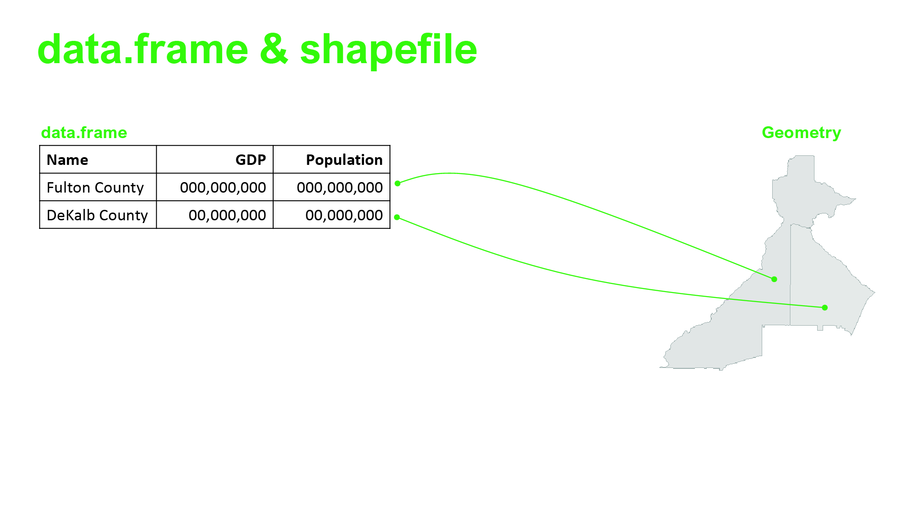

---
class: center, middle
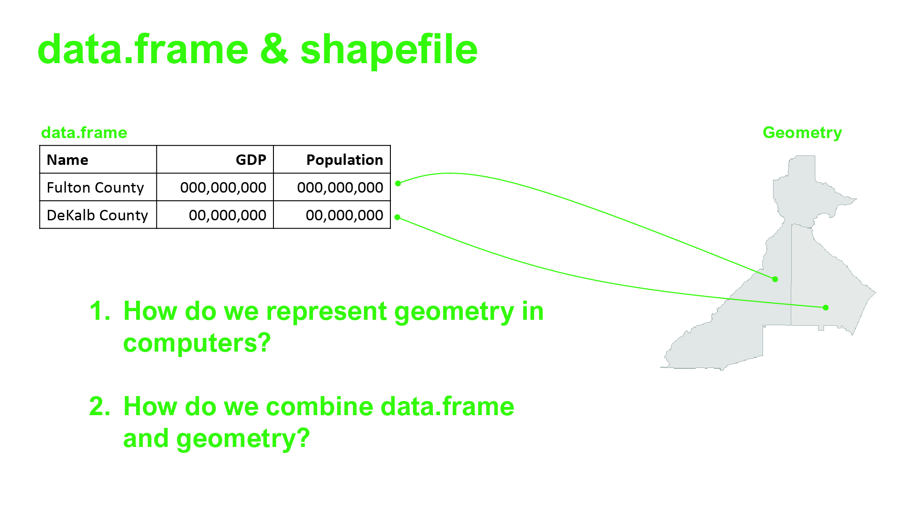
---

.font180[.green[sf package in R]]

The **sf** stands simple features. 

**"Simple features are a standardized way of encoding spatial vector data (points, lines, polygons) in computers" (Pebesma, 2018, 439).**

.font90[
* *Feature* can be thought of as "things" or objects that have a spatial location or extent (e.g., building or political state).
* *Feature geometry* refers to the spatial properties (location or extent) of a feature.
* *Feature attributes* refers to other properties that features have, such as name, some measured quantity, etc.
* *Simple feature access* is an international standard for representing and encoding spatial data
]


.footnote[
This content is adopted from Pedesma (2018) [Read](https://journal.r-project.org/archive/2018/RJ-2018-009/RJ-2018-009.pdf)
]

---
class: center, middle
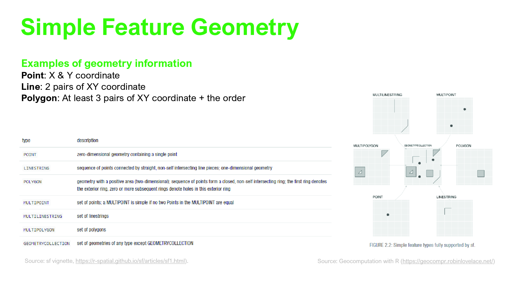

---
class: center, middle
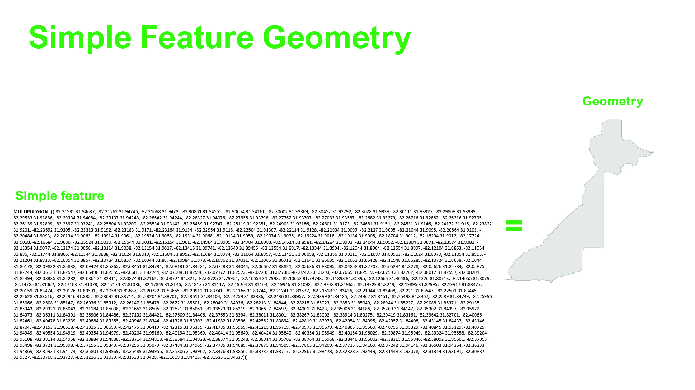

---
class: center, middle
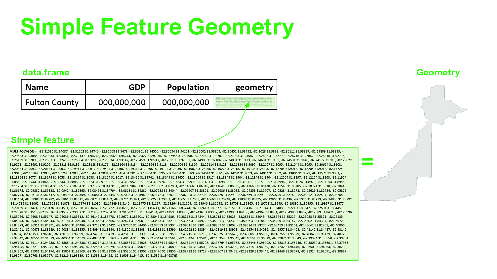

---
class: center, middle
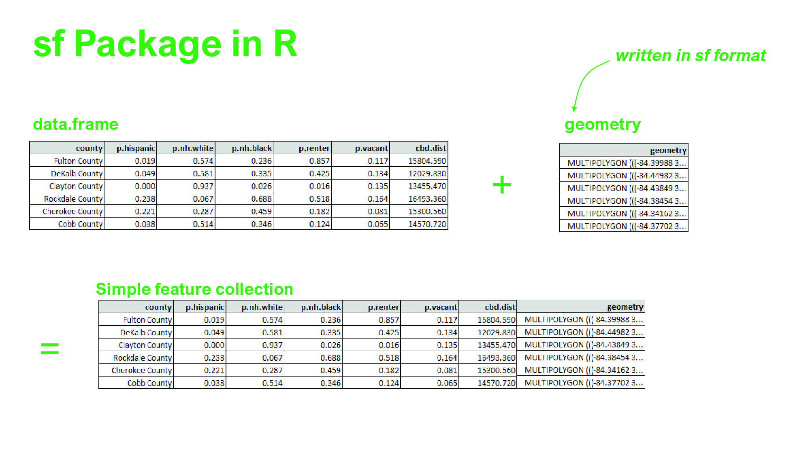


---
## Let's do some coding

```{r, eval=F}
library(sf)
mysf <- sf::st_read("https://raw.githubusercontent.com/BonwooKoo/UrbanAnalytics2022/main/Lab/module_0/testdata.geojson")
```

```{r message=F, include=F}
mysf <- sf::st_read("https://raw.githubusercontent.com/BonwooKoo/UrbanAnalytics2022/main/Lab/module_0/testdata.geojson")
```

.scriptsize[
```{r}
mysf %>% print()
```
]
---
## What's inside geometry column
.footnotesize[
.scroll-box-10[
```{r}
mysf[['geometry']]
```
]

```{r}
mysf[['geometry']][[1]]
```
]
---
class: center, middle
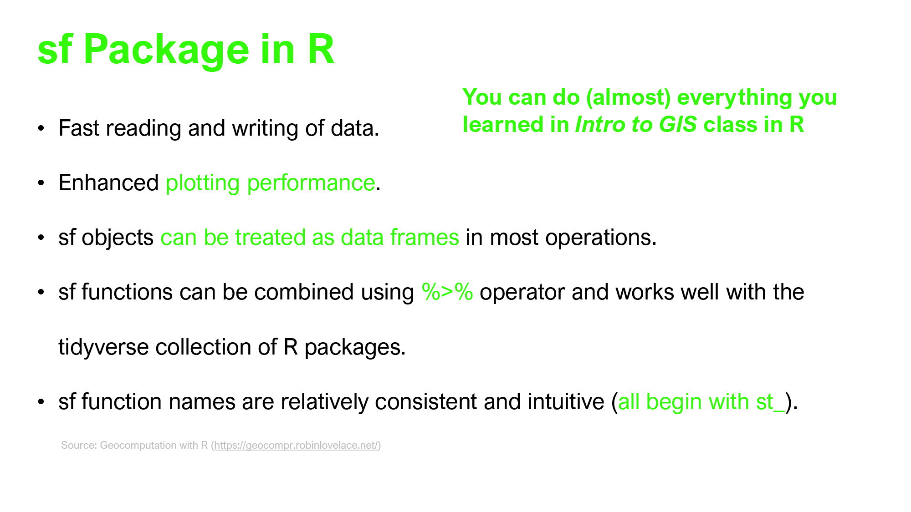

---
class: center, middle
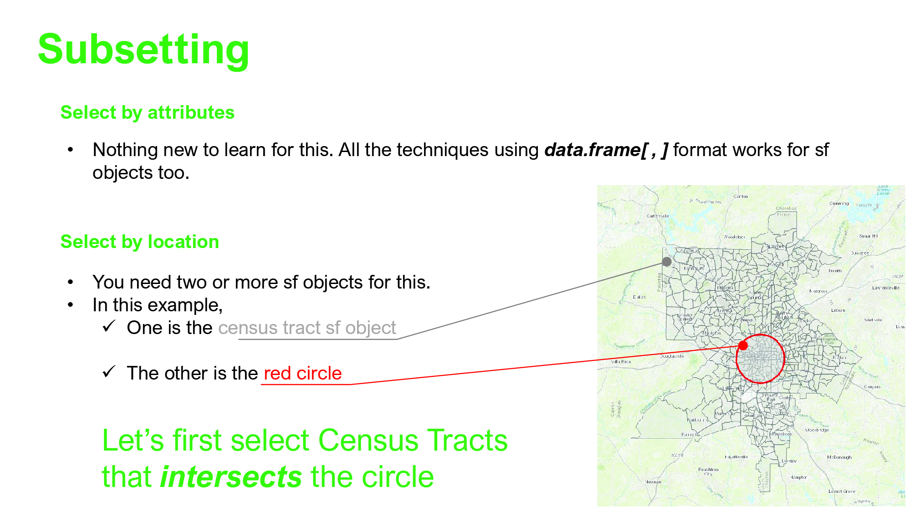

---
class: center, middle
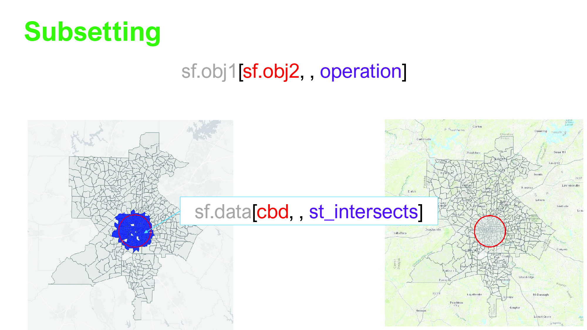

---
class: center, middle
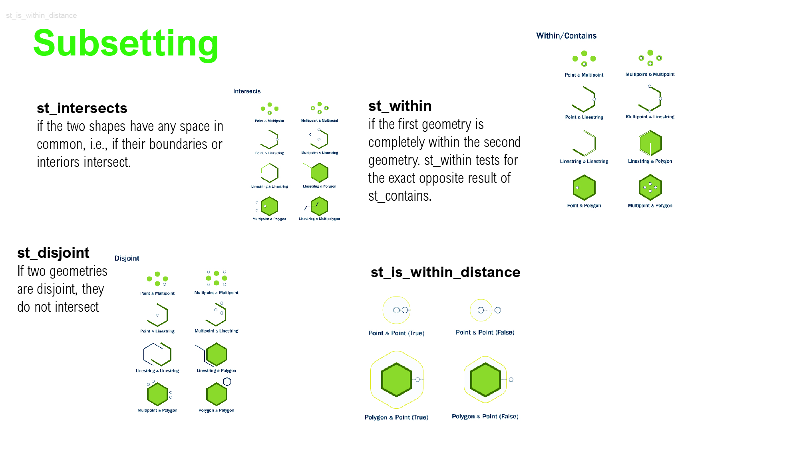

---
class: center, middle
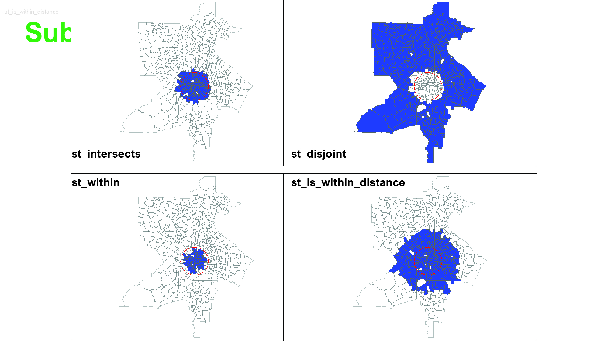

---
class: center, middle
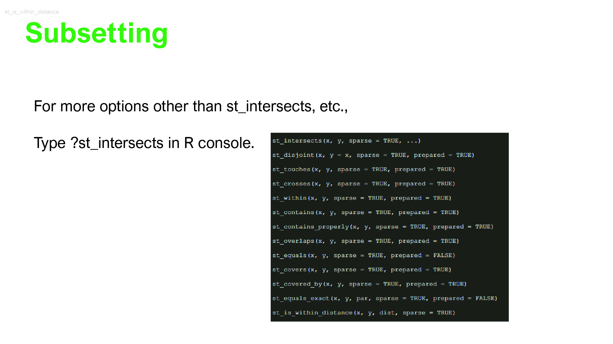

