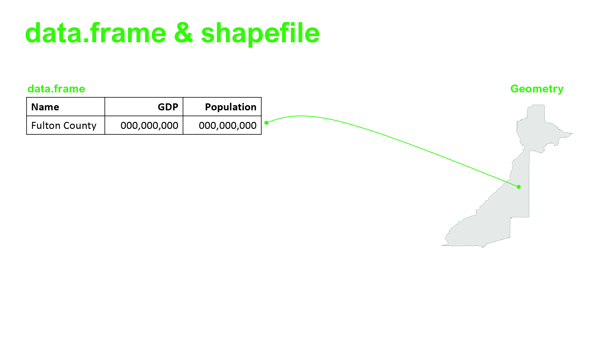

class: inverse, middle

# Intro to R - 2


.font100[
Bon Woo Koo & Subhro Guhathakurta

8/30/2022
]

```{r, include=F}
library(xaringanthemer)
library(sf)
library(tidyverse)
library(leaflet)
library(tmap)
library(kableExtra)
```

---

##.green[Content]

We will go through:

.mid[
* Handling geospatial data in R using sf package
* Loops and apply
* R Markdown + Rpubs
]

---

class: center, middle

---
class: center, middle


---
class: center, middle

---

.font180[.green[sf package in R]]

The **sf** stands simple features. 

**"Simple features are a standardized way of encoding spatial vector data (points, lines, polygons) in computers" (Pebesma, 2018, 439).**

.font90[
* *Feature* can be thought of as "things" or objects that have a spatial location or extent (e.g., building or political state).
* *Feature geometry* refers to the spatial properties (location or extent) of a feature.
* *Feature attributes* refers to other properties that features have, such as name, some measured quantity, etc.
* *Simple feature access* is an international standard for representing and encoding spatial data
]


.footnote[
This content is adopted from Pedesma (2018) [Read](https://journal.r-project.org/archive/2018/RJ-2018-009/RJ-2018-009.pdf)
]

---
class: center, middle


---
class: center, middle


---
class: center, middle


---
class: center, middle

---

* Fast reading and writing of data (but not necessarily plotting)
* sf objects can be treated as data.frames
* Works smoothly with dplyr verbs as well as %>%.
* I personally do not use ArcGIS at all. 99% of my GIS works are done in R using sf package.


.footnote[image source: https://r-spatial.github.io/sf/articles/sf1.html]

---
## Let's do some coding

```{r, eval=F}
library(sf)
census <- sf::st_read("https://raw.githubusercontent.com/BonwooKoo/UrbanAnalytics2022/main/Lab/module_0/testdata.geojson")
marta <- sf::st_read("https://raw.githubusercontent.com/BonwooKoo/UrbanAnalytics2022/main/Lab/module_0/MARTA_Routes.geojson")
five_point <- sf::st_read("https://raw.githubusercontent.com/BonwooKoo/UrbanAnalytics2022/main/Lab/module_0/five_point.geojson")
```

```{r message=F, include=F}
census <- sf::st_read("https://raw.githubusercontent.com/BonwooKoo/UrbanAnalytics2022/main/Lab/module_0/testdata.geojson") 
marta <- sf::st_read("https://raw.githubusercontent.com/BonwooKoo/UrbanAnalytics2022/main/Lab/module_0/MARTA_Routes.geojson") 
five_point <- sf::st_read("https://raw.githubusercontent.com/BonwooKoo/UrbanAnalytics2022/main/Lab/module_0/five_point.geojson") %>% st_transform(crs = 26967)
```

.footnotesize[.scroll-box-18[
```{r}
census %>% print()
```
]]
---
## What's inside geometry column
.footnotesize[
.scroll-box-10[
```{r}
census %>% st_geometry()
```
]

```{r}
census[['geometry']][[1]]
```
]
.scroll-box-10[.footnotesize[
```{r}
census %>% st_coordinates()
```
]]
---
## Interactive Mapping - tmap package
```{r, out.width="100%", out.height="300px"}
library(tmap)
tmap_mode('view')
tm_shape(census) + tm_polygons(col="hhincome")
```

---
## Data manipulation

.font90[
#### Select by attributes
All the verbs from dplyr packages work with sf objects. 

.footnotesize[.scroll-box-20[
```{r, out.width="100%"}
census %>% 
  select(county, hhincome) %>% 
  filter(county %in% c("Clayton County", "Fulton County")) %>% 
  group_by(county) %>% 
  summarise(count = n(),
            med.income = median(hhincome, na.rm = TRUE))
```

Notice that although the code didn't mention the geomtry column, it automatically follows.
]]]
---
## Subsetting by geospatial

#### Select by location

When you have two or more sf objects, you can select a subset. Let's do a demo with Census Tracts and a 10-KM buffer from the Five Points Station.


.pull-left[
.scriptsize[
```{r eval=F}
# Visualization
leaflet() %>% 
  addProviderTiles(providers$CartoDB.Positron) %>% 
  addPolygons(data = census, weight=1, color="grey") %>% #<<
  addPolygons(data = five_point, weight=1) %>% #<<
  addLegend("bottomright", 
            colors = c("blue", "grey"), 
            labels = c("five_point", 
                       "poly"), 
            title="Legend")
```
]]

.pull-right[
.script-size[
```{r echo=F, message=F, warning=F}
fp.buffer <- suppressWarnings(five_point %>% st_buffer(dist = 10000)) 
# Visualization
leaflet(height=330, width="100%") %>% 
  addProviderTiles(providers$CartoDB.Positron) %>% 
  addPolygons(data = census, weight=1, color="grey") %>% 
  addPolygons(data = fp.buffer, weight=1) %>% 
  addLegend("bottomright", 
            colors = c("blue", "grey"), 
            labels = c("five_point", 
                       "poly"), 
            title="Legend")
```
]]
---
## Subsetting
The magic syntax is: 

.center[.red[sf-obj-1][.blue[sf-obj-2], , .green[operation]]]

.footnotesize[
Try the following code in your console. You will get an error saying **st_crs(x) == st_crs(y) is not TRUE**.

In sf package, predicates require the sf objects are in the same coordinate reference systems (CRS). We can transform the CRS of sf objects with **st_transform()**.
]

.footnotesize[
```{r eval=F}
# Subsetting by location
census[five_point, , op = st_intersects]
```
]

.scroll-box-10[.footnotesize[
```{r}
# Changing CRS
(five_point <- five_point %>% st_transform(crs = 4326))
```
]]
---
## Subsetting

.footnotesize[
```{r}
# Subsetting
census.subset <- census[five_point, , op = st_intersects] 
```
]

.scriptsize[
```{r}

# Visualization
leaflet(width="100%", height=300) %>% 
  addProviderTiles(providers$CartoDB.Positron) %>% 
  addPolygons(data = census, weight=1, color="grey", 
              fillColor="grey", fillOpacity=0.2) %>% # Original Tract
  addPolygons(data = census.subset, weight=1, fillOpacity = 0.7) %>% # Subsetted Tract
  addPolygons(data=five_point, weight=2, 
              fillOpacity = 0, color="black") %>% # The circle
  addLegend("bottomright", 
            colors = c("grey", "blue", "black"),
            labels = c("Original Census Tracts", 
                       "Subset",
                       "Buffer from Five Point Stations"),
            title="Legend")
```
]

---
## Predicates
.font80[
In GIS, "**predicates are Boolean functions** that return TRUE if a comparison meets the functions criteria; otherwise, they return FALSE (f), to determine if a specific relationship exists between a pair of geometries." ([ESRI](https://help.arcgis.com/en/geodatabase/10.0/sdk/arcsde/concepts/geometry/shapes/spatial_relations/predicates.htm)).

Try **?st_intersects** in your console.
]


```{r echo=F}
knitr::include_graphics("predicates.jpg", dpi=50)
```
---

.footnotesize[
```{r echo=F}
pred_within <- census[five_point, , op = st_within]
pred_disjoint <- census[five_point, , op = st_disjoint]
pred_is_within_distance <- census[five_point, , op = st_is_within_distance,dist=10000]
```

```{r}
a <- leaflet() %>% 
  addProviderTiles(providers$CartoDB.Positron) %>% 
  addPolygons(data = pred_is_within_distance, weight=1,color="grey") %>% 
  addPolygons(data = five_point, color="black") %>% 
  addControl(html="<b>st_is_with_distance (10k)</b>", "topright")

b <- leaflet() %>% 
  addProviderTiles(providers$CartoDB.Positron) %>% 
  addPolygons(data = pred_disjoint, weight=1,color="grey") %>% 
  addPolygons(data = five_point, color="black") %>% 
  addControl(html="<b>st_disjoint</b>", "topright")

leafsync::sync(a,b)
```
]
---
```{r, echo=F}
knitr::include_graphics("https://geocompr.robinlovelace.net/05-geometry-operations_files/figure-html/venn-clip-1.png")
```


---
class: inverse, center, middle

#If we have time left..

---
## Visualizing linestring and points
Let's visualize the first LINESTRING (i.e., Blue Line of MARTA) and the points that makes the LINESTRING.


.pull-left[
#### Extracting points
.scroll-box-20[
.footnotesize[
```{r}
marta.point <- marta %>% 
  # Extract the first row
  slice(2) %>% 
  # Turn it into coordinates
  st_coordinates() %>% 
  # Turn it into df
  as.data.frame() %>% 
  # df to sf
  st_as_sf(coords = c("X", "Y"), 
           crs = 4326)

marta.point
```
]
]
]

.pull-right[
#### Extracing line
.scroll-box-20[
.footnotesize[
```{r}
marta.line <- marta %>% 
  # Extract the first row
  slice(2) 

marta.line
```
]
]
]
---
## (A side note)Plotting them together

```{r out.width="100%", out.height="50%"}
library(leaflet)
leaflet() %>% 
  addProviderTiles(providers$CartoDB.Positron) %>% # Background map
  addPolylines(data = marta %>% slice(c(1,3)), 
               color="grey", weight=1) %>% # Adding non-Blue lines
  addPolylines(data = marta.line) %>% # Adding marta.line #<<
  addCircles(data = marta.point) # Adding marta.point #<<
```

---
## Why this is useful
Being able to parse the geometry at point level allows us to do any manipulation we want to do. 

For example, we want to cut the line into two at near Five Points Station (33.7539, -84.3916).
.footnotesize[
.scroll-box-14[
```{r}
# Creating POINT feature for five point station
five_point_station <- st_point(c(-84.3916, 33.7539)) %>% st_sfc(crs = 4326)

# Calculate pairwise distance to all points that define Gold line
dist.mat <- marta.point %>% st_distance(five_point_station)

# Which row contains the closest point?
closest.pnt <- which.min(dist.mat)

# Parse marta.line and create a cut-off line
marta.line.cut <- marta.line %>% 
  st_coordinates() %>% as.data.frame() %>% 
  mutate(break.point = c(rep("South",closest.pnt), rep("North",nrow(.)-closest.pnt))) %>% 
  st_as_sf(coords=c("X", "Y"), crs = 4326) %>% 
  group_by(break.point, L1) %>% summarise(do_union=FALSE) %>% st_cast("LINESTRING") %>% 
  group_by(break.point) %>% summarise(do_union=FALSE) %>% st_cast("MULTILINESTRING")

marta.line.cut
```
]
]

.center[
### No need to understand this code! I just wanted to demonstrate what can be done.
]
---
.scriptsize[
```{r, out.width="100%", out.height="50%"}
pal <- colorFactor(palette = c("red", "blue"), domain = marta.line.cut$break.point)
  
leaflet() %>% 
  addProviderTiles(providers$CartoDB.Positron) %>% 
  addPolylines(data = marta.line.cut, color = ~pal(break.point)) %>% 
  addPolylines(data = marta %>% slice(1,3), color="grey", weight=1) %>% 
  addCircles(data=five_point_station, color="black", radius=300) %>% 
  addLegend("bottomright", pal = pal, values = marta.line.cut$break.point)
```
]

---
class: inverse, middle, center
# R-Markdown + RPubs

---