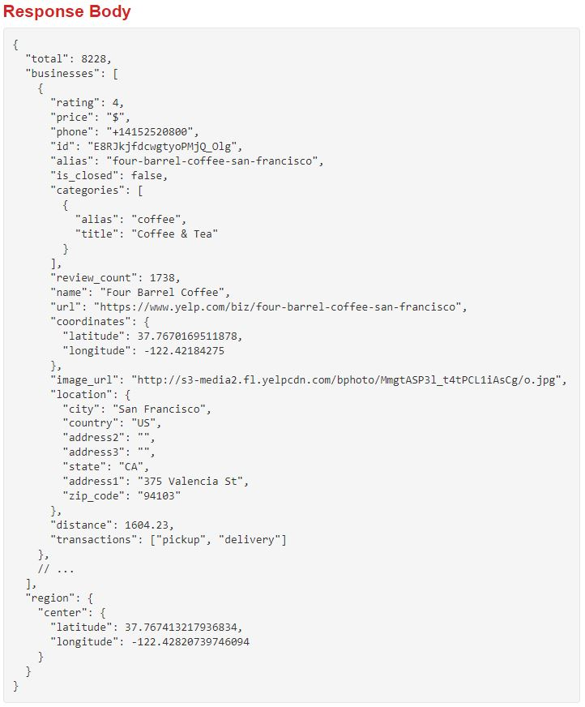

```{r setup, include=FALSE}
knitr::opts_chunk$set(echo = TRUE)
```

# Getting data through API
In this document, we will use API (application programming interface) to acquire data from the Census Bureau & from Yelp Fusion API. According to Wiki, "An API is a way for two or more computer programs to communicate with each other." To use API, we generally need to connect to the endpoint of API server, which often looks something like `https://api.yelp.com/v3`. We then append other parameters to complete it. 

For example, the following is requesting **business search** service using a keyword **delis** for the location latitude of 37.787 and longitude of -122.399.

> `https://api.yelp.com/v3/businesses/search?term=delis&latitude=37.786882&longitude=-122.399972`

In our everyday terms, think of this as a data request application form. Once this 'form' is created, we need to send this 'form' to the server (i.e., the data provider). We would use e.g., `GET()` function in **httr package** to send API request to the server, and the server would return something like the following to the authenticated requests.



This JSON format can be reformatted into a data.frame format using e.g., **jsonlite** and **reshape2** packages. 


# New functions introduced in this document

Function                  Description
-----------------------   ---------------
tidycensus::get_acs()     Downloads ACS data
sf::st_bbox()             Get the bounding box 
sf::st_point()            Create POINT simple feature geometry
sf::st_centroid()         Get the centroid of a geometry
sf::st_distance()         Calculate Euclidian distance between pairs of geometries
sf::st_geometry           Get geometry from an sf object
sf::st_transform()        Transform coordinates of sf object
sf::st_coordinates()      Get coordinates in matrix form
sf::st_set_geometry()     Set geometry of an sf object
sf::st_as_sf()            Convert foreign object to an sf object
sf::st_join()             Spatial join
sapply()                  Apply a function over a list or vector
min()                     Return the minima of the input values
max()                     Return the minima of the input values
abs()                     Return absolute valueof the input value
seq()                     Generate a regular sequences
expand.grid()             Create a data.frame from all combinations of supplied vectors or factors.
names()                   Get (or set) the names of an object
paste0()                  Concatenate vectors after converting to character
ceiling()                 Returns a numeric vector containing the smallest integers not less than x
bind_rows()               Binding rows of data.frames into one.
Sys.getenv()              Access the values of the environment variables              
list.files()              Returns a character vector of the names of files or folder in the named folder.
units::set_units()        Creates object of class units 
osmdata::getbb()          Uses the free Nominatim API provided by OpenStreetMap to find the bounding box (bb) associated with place names.
yelpr::business_search()  Search bussiness on Yelp using Yelp Fusion API's business search endpoint
jsonlite::flatten()       Flattens nested data frame (i.e., data frames with one or more columns consisting of another data frame)
purrr::map_lgl()          Funtional that returns a logical vector

# Understanding Yelp Business Search
Remember that all APIs are different. Being familiar with Yelp Fusion API does not tell you anything about how Google Street View API is structured. So the first thing you need to do is to [**READ THE DOCUMENTATION OF YELP FUSION API**](https://www.yelp.com/developers/documentation/v3/get_started).

Yelp Fusion API has various endpoints: Business Search, Phone Search, Transaction Search, Business Details etc. You will notice that for everyting except **Business Search**, you need to have some information about the business you are looking for (e.g., business id, phone number, exact location, etc). Business Search allows us to search business by keywords (e.g., Ray's), catergories (e.g., cafe), location (e.g., coordinates), etc. **This is what we need.**


> **There is [Yelp Open Dataset](https://www.yelp.com/dataset). Why not use this instead?** <br> It is a subset of our businesses, reviews, and user data for use in personal, educational, and academic purposes, containing 6,990,280 reviews and 150,346 businesses from 11 metropolitan areas. However, I do not know whether this data is a sample or not. If it is a sample, we would need to know the sampling method, when the sampling was done, when the update will be made, etc. In other words, we don't have information on velocity and exhaustivity of the data.

# Downloading Census Track polygons
An important limitation of the Business Search in Yelp Fusion API is **it returns up to 1,000 businesses based on the provided search criteria**. It means if you request Yelp to return all restaurants in Atlatna using one search criteria, you may not get all the restaurants in Atlanta if there are more than 1000 of them in Atlanta. If we narrow down the search scope

that Due to the limits in Yelp API in terms of how many results (i.e., rows) can be returned per each querry, it is safer to break the querry into smaller bits.

There are many strategies for doing that, and I am using Census Tracts as the 'bits'. 

The Census Bearue provides a good API, which was implemented into R through a package named *tidycensus*. To retrieve the American Community Survey data, we can use `get_acs()` function. To all functionalities in *tidyverse* package, try reading this  [official documentation](https://walker-data.com/tidycensus/). 

To use `get_acs()`, we first need to understand what arguments are needed for this function. Try `?tidycensus::get_acs` in your console to check the documentation for this function.

We will specify the following argument and leave the rest as default: geography, state, county, variables, year, survey, geometry, and output. The returned output from this function is assigned to an R object named `tract`.

```{r message=F}
library(tidycensus)
library(sf)
library(tmap)
library(jsonlite)
library(tidyverse)
library(httr)
library(jsonlite)
library(reshape2)
library(here)
library(yelpr)
```

# Add API Key somewhere here

```{r}
#### Tract polygons for the center of Yelp querry
tract <- get_acs(geography = "tract",
                 state = "GA",
                 county = c("Fulton", "Dekalb"),
                 variables = c(hhincome = 'B19019_001',
                               race.tot = "B02001_001", 
                               race.white = "B02001_002", 
                               race.black = 'B02001_003'
                               ),
                 year = 2019,
                 survey = "acs5",
                 geometry = TRUE,
                 output = "wide") %>% 
  select(geo.id = GEOID, 
         hhincome = hhincomeE,
         race.tot = race.totE,
         race.white = race.whiteE,
         race.black = race.blackE)

# Function: Get tract-wise radius
get_r <- function(poly){
  # Get bounding box
  bb <- st_bbox(poly) 
  # Get one point of the bb
  bb_p <- st_point(c(bb[1], bb[2])) 
  # Get centroid of the bb
  c <- st_centroid(poly) 
  # Distance between bb_p and c
  r <- st_distance(bb_p, c)
  return(r)
}

r4all <- tract %>%
  st_geometry() %>% st_transform(crs = 26967) %>% 
  sapply(., function(x) get_r(x))

tract$radius <- units::set_units(r4all,m)

tract.c <- st_centroid(tract) %>% st_transform(4326)
tract.c$x <- st_coordinates(tract.c)[,1]
tract.c$y <- st_coordinates(tract.c)[,2]
tract.c <- tract.c %>% st_set_geometry(NULL)
```

To visualize what `tract.c` means, run the following code.

```{r}
tmap_mode('view')

tract.c[1:10,] %>% 
  st_as_sf(coords = c("x", "y"), crs = 4326) %>%
  st_buffer(., dist = .$radius) %>% 
  tm_shape(.) + tm_polygons(alpha = 0.5, col = 'red') +
  # Comparison to the original polygon
  tm_shape(tract[1:10,]) + tm_borders(col= 'blue') 

# Look at geo.id == '13121009502'.
# Why is the buffer a bit too large than the polygon while other tracts have correctly sized circles?
```

| Quiz: Look at GEOID = 13121009502. You will notice that the radius is slightly too large for the Census Track. Other tracks will display circles that fits the size of Census Tract much better. Why do you think this happened?


An alternative way to get a similar result is shown below. To see what the code below does, you can copy the code and run it in the console.

```{r eval=FALSE}
# Get bb for two counties
fulton_bb <- osmdata::getbb("Fulton County, GA")
dekalb_bb <- osmdata::getbb("DeKalb County, GA")

# Find coordinates for the four sides of the bb
left_x <- min(c(fulton_bb[1,],dekalb_bb[1,])) # <<-- smaller , larger(i.e., closer to zero) -->>
right_x <- max(c(fulton_bb[1,],dekalb_bb[1,]))
bottom_y <- min(c(fulton_bb[2,],dekalb_bb[2,]))
top_y <- max(c(fulton_bb[2,],dekalb_bb[2,]))

# Break the bb into a grid
fishnet_n <- 40
steps <- abs(left_x - right_x)/fishnet_n


# Fishnet points
fish_x <- seq(from = left_x, to = right_x, by = steps)
fish_y <- seq(from = bottom_y, to = top_y, by = steps)

fishnet <- expand.grid(fish_x, fish_y) %>% 
  rename(x = Var1, y = Var2) %>% 
  st_as_sf(coords = c('x', 'y'), crs = 4326)

# Visualize it
tm_shape(fishnet %>% 
           st_buffer(dist = units::set_units(steps, "degree"))) + tm_polygons(alpha = 0.2, col = 'red')

```


# Defining function for accessing Yelp API

This function below generates a fully-cleaned output. In class, we can provide students with a function that generates raw output (or close to raw) and have them clean it step by step.

After the cleaning process, we can come back to this function and modify the function to embed the cleaning process inside the function.

Mini-quiz -> how to supress messages

```{r}
#### yelp api function
yelp_search <- function(lat, lon, radius, category, api.key){
  # Pagination inddex
  count <- 1
  # Initial run (needed to get $total value)
  json <- business_search(api_key = api.key, 
                          categories = category, 
                          latitude = lat, 
                          longitude = lon, 
                          offset = (count - 1)*50, 
                          radius = radius, 
                          limit = 50) 
  # If there is no match from Yelp
  if (json$total == 0) {
    # Create an empty data.frame 
    json.all <- data.frame(id = NA, name = NA, categories = category, 
                           n.rating = NA, rating = NA, price = NA, is_closed = NA, 
                           lat = NA, lon = NA)
  # Else
  } else {
    # Convert json-like structure into data.frame format
    json.all <- json$businesses %>% 
      jsonlite::flatten() %>% # to eliminate nested structure
      mutate(price = ifelse('price' %in% names(.), price, NA), # If there is no price column
             is_closed = ifelse('is_closed' %in% names(.), is_closed, NA)) %>%  # is there is no is_close column
      select(id, name, categories, 
             n.rating = review_count, 
             rating, price, is_closed, 
             lat = coordinates.latitude, 
             lon = coordinates.longitude) # select & name changes
    
    # Drop rows that have zero entries in category column
    #####################################################
    # Change the code below to simplify it

    # Unlist the category column and create a character string seperated by comma
    # <- This function 'melt' emits many messages. Suppressing them.
    
    cate.title <- suppressMessages({
      reshape2::melt(json.all$categories)
      }) %>% 
      group_by(L1) %>% 
      summarize(categories = paste0(title, collapse = ", "))
    
    
    # Replace category column in the original table with the cleaned one
    json.all$categories <- cate.title$categories
    
    # Get how many querries are required to loop through all matches
    offset_n <- ceiling(json$total / 50)
    
    # Start looping
    while(offset_n > count){
      count <- count + 1
      if (offset_n != count){ # For all loop before the final one
        json <- business_search(api_key = api.key, 
                                categories = category, 
                                latitude = lat, 
                                longitude = lon, 
                                offset = (count - 1)*50, 
                                radius = radius, 
                                limit = 50)
        
      } else { # The final one
        json <- business_search(api_key = api.key, 
                                categories = category, 
                                latitude = lat, 
                                longitude = lon, 
                                offset = (count - 1)*50, 
                                radius = radius, 
                                limit = json$total - 50*(count - 1))
        
      }
      
      # Convert json-like structure into data.frame format
      json.cont <- json$businesses %>% 
        mutate(price = ifelse('price' %in% names(.), price, NA),
               is_closed = ifelse('is_closed' %in% names(.), is_closed, NA)) %>% 
        jsonlite::flatten() %>% select(id, name, categories, 
                                       n.rating = review_count, 
                                       rating, price, is_closed, 
                                       lat = coordinates.latitude, 
                                       lon = coordinates.longitude)
      
      # Some rows do not have category names. It is okay to keep them, 
      # but for the purpose of exercise, let's try dropping such rows.
      category_filter <- map_lgl(json.cont$categories, function(x) length(x[[1]]) != 0)
      
      json.cont <- json.cont[category_filter,]
      
      cate.title <- suppressMessages({
        reshape2::melt(json.cont$categories)
        }) %>% 
        group_by(L1) %>% 
        summarize(categories = paste0(title, collapse = ", "))
      
      json.cont$categories <- cate.title$categories
      
      # This version of code has redundancy. I need to organize it such that 
      # this cleaning process is done once.
      json.all <- bind_rows(json.all, json.cont)
    }
  }
  
  return(json.all)
}
```


```{r}
#### data download 
# API key
api.key <- Sys.getenv('yelp_api') # To Subhro, to use this code, you need to edit your system envirnnment variables. See https://www.howtogeek.com/787217/how-to-edit-environment-variables-on-windows-10-or-11/#:~:text=In%20the%20System%20Properties%20window,%2C%20and%20click%20%E2%80%9COK.%E2%80%9D

# Receiving DF
result.temp <- data.frame(geo.id = integer(0), 
                          id = integer(0), 
                          name = integer(0), 
                          categories = integer(0),
                          n.rating = integer(0), 
                          rating = integer(0), 
                          price = integer(0), 
                          is_closed = integer(0), 
                          lat = integer(0), 
                          lon = integer(0))

# Read yelp.csv if it already exists in your drive
if ("yelp.csv" %in% list.files(getwd())){
  yelp <- read.csv("yelp.csv")
} else {
  # If the file doesn't exist, get it from the Yelp server
  for (i in 1:nrow(tract.c)) {
    temp <- tract.c[i,]
    lat <- temp$y
    lon <- temp$x
    radius <- round(as.numeric(temp$radius))
    json <- yelp_search(lat, lon, radius, 'restaurant', 
                        api.key) %>% 
      mutate(geo.id = temp$geo.id)
    result.temp <- result.temp %>% rbind(json)
    print(paste0("Done with ", i))
  }
  
  # rm(i, json, lat, lon, api.key, radius, temp, tract.c, yelp_search)
  write.csv(result.temp, "yelp.csv")
}

```


*Done!*


# Doing it from the scratch

Shown below is the raw output from the `business_search()` in `yelpr` package.

*I first need to identify what sorts of clean can be done to this file.* If there are other types of cleaning, I will need to show students how to trouble shoot. I might have students to the Googling themselves and have them go through the process themselves in the classroom.

```{r}
# In case you want to see the raw query 
test <- business_search(api_key = Sys.getenv('yelp_api'),
                        category = 'restaurant',
                        latitude = 33.74876295437723,
                        longitude = -84.39073773089834,
                        offset = 1,
                        radius = 1000,
                        limit = 50)
```

```{r}
test_rest <- yelp_search(lat = 33.74876295437723,
                         lon = -84.39073773089834,
                         radius = 1000,
                         category = 'restaurant',
                         api.key = Sys.getenv('yelp_api'))
```

# Cleaning process

## What issues do we see in the raw download?
[API-related issues]
- Pagination.
- Try `class(test)`. What is this that we get from `business_search()` function?
  - test running `jsonlite::flatten(test$businesses) %>% select(coordinates.latitude, coordinates.longitude)` and `test$businesses %>% select(coordinates.latitude, coordinates.longitude)`. The latter will not run.
- Nested data.frame structure
- Inconsistent return columns

[Data cleaning]
- Closed business.
- Missing values.
- Unintuitive values, such as \$ and \$\$ for the price level.
- Category column is not really useful


```{r}
## Saving the R environment
# save.image("D:/Dropbox (GaTech)/Work/Working/School/UA_2022/Lab/W3/yelp_test.RData")
```

# Merging the cleaned data with Census data

One of the most commonly used and basic source of data on wide array of different aspects of life is, of course, the Census data. It is incredibly useful if you can 'join' one geospatial data to census data.

### Converting the downloaded Yelp data to a geospatial data

```{r}
# Converting the POI result into SF
result.sf <- result.temp %>% 
  filter(!is.na(lat) | !is.na(lon)) %>% 
  st_as_sf(coords = c("lon", "lat"), dim = "XY", crs = 4326)
```


### Spatial join the two data
```{r}
# Spatial join the SF to Census data
result.census <- result.sf %>% 
  st_join(tract %>% st_transform(crs = 4326), st_intersects)

# result.census %>% 
#   st_write("D:/Dropbox (GaTech)/Work/Working/School/UA_2022/Lab/W3/restaurant_census.geojson")
```

```{r}
# # Visualize the map
# tmap_mode('view')
# tm_shape(result.census) + tm_dots(col = "hhincome")
```

