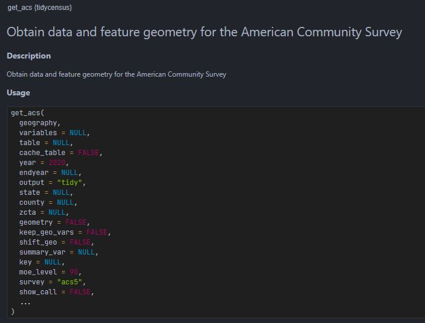

```{r setup, include=FALSE}
knitr::opts_chunk$set(echo = TRUE)
```


# New functions introduced in this document

Function                Description
---------------------   ---------------
tidycensus::get_acs     Downloads ACS data
sf::st_bbox             Get the bounding box 
sf::st_point            Create POINT simple feature geometry
sf::st_centroid         Get the centroid of a geometry
sf::st_distance         Calculate Euclidian distance between pairs of geometries
sf::st_geometry         Get geometry from an sf object
sf::st_transform        Transform coordinates of sf object
sf::st_coordinates      Get coordinates in matrix form
sf::st_set_geometry     Set geometry of an sf object
sf::st_as_sf            Convert foreign object to an sf object
sf::st_join             Spatial join
sapply                  Apply a function over a list or vector
min                     Return the minima of the input values
max                     Return the minima of the input values
abs                     Return absolute valueof the input value
seq                     Generate a regular sequences
expand.grid             Create a data.frame from all combinations of supplied vectors or factors.
names                   Get (or set) the names of an object
paste0                  Concatenate vectors after converting to character
ceiling                 Returns a numeric vector containing the smallest integers not less than x
bind_rows               Binding rows of data.frames into one.
Sys.getenv              Access the values of the environment variables              
list.files              Returns a character vector of the names of files or folder in the named folder.
units::set_units        Creates object of class units 
osmdata::getbb          Uses the free Nominatim API provided by OpenStreetMap to find the bounding box (bb) associated with place names.
yelpr::business_search  Search bussiness on Yelp using Yelp Fusion API's business search endpoint
jsonlite::flatten       Flattens nested data frame (i.e., data frames with one or more columns consisting of another data frame)
purrr::map_lgl          Funtional that returns a logical vector


# Getting data through API
In this document, we will use API (application programming interface) to acquire data from the Census Bureau & from Yelp Fusion API. According to Wiki, "An API is a way for two or more computer programs to communicate with each other." To use API, we generally need to connect to the endpoint of API server, which often looks something like `https://api.yelp.com/v3`. We then append other parameters to complete it. 

For example, the following is requesting **business search** service using a keyword **delis** for the location latitude of 37.787 and longitude of -122.399.

> `https://api.yelp.com/v3/businesses/search?term=delis&latitude=37.786882&longitude=-122.399972`

In our everyday terms, think of this as a data request application form. Once this 'form' is created, we need to send this 'form' to the server (i.e., the data provider). We would use e.g., `GET()` function in **httr package** to send API request to the server, and the server would return something like the following to the authenticated requests.


This JSON format can be reformatted into a data.frame format using e.g., **jsonlite** and **reshape2** packages. 


# Understanding Yelp Business Search
All APIs are different. Being familiar with Yelp Fusion API does not tell you anything about how Google Street View API is structured. So the first thing you need to do is to [**READ THE DOCUMENTATION OF YELP FUSION API**](https://www.yelp.com/developers/documentation/v3/get_started).

Yelp Fusion API has various endpoints: Business Search, Phone Search, Transaction Search, Business Details etc. You will notice that for everyting except **Business Search**, you need to have some information about the business you are looking for (e.g., business id, phone number, exact location, etc). Business Search allows us to search business by keywords (e.g., Ray's), catergories (e.g., cafe), location (e.g., coordinates), etc. **This is what we need.** Let's look at the related parameters of [Business Search](https://www.yelp.com/developers/documentation/v3/business_search).

1. The Business Search takes various input parameters, some optional and others required. Most importantly, we need to provide **geographic information** in which we want to do a search. We can provide it through one of the following ways: 

  * `location` parameter: E.g., New York City, NYC, 350 5th Ave, etc.
  * `longitude and latitude` parameter: E.g., 33.7484, -84.3902.
  * `radius` parameter: Search radius. Note that the actual search radius may vary. Max 40,000 meters.

2. Other important parameters are `limit` and `offset`.

  * `limit` parameter: Number of business results to return. For results of more than 50 businesses, Yelp returns results in **multiple pages**. The `limit` parameter determines how many businesses are contained in one page.
  * `offset` parameter: This parameter defines the amount by which the returned results are offset. For example, with `limit` of 50, the first request will give us 50 businesses. To get 51th ~ 100th business, we should set `limit = 50`.

An important limitation of the Business Search in Yelp Fusion API is that **it returns up to 1,000 businesses based on the provided search criteria**. It means if you request Yelp to return all restaurants in Atlatna using one search criteria, you may not get all the restaurants in Atlanta if there are more than 1000 of them in Atlanta. **You would need to break your search into smaller bits to ensure that you get less than 1000 hits for each search criteria**.


> **There is [Yelp Open Dataset](https://www.yelp.com/dataset). Why not use this instead?** <br> It is a subset of the businesses, reviews, and user data for use in personal, educational, and academic purposes, containing 6,990,280 reviews and 150,346 businesses from 11 metropolitan areas. <br><br> However, I do not know whether this data is a sample or not. If it is a sample, we would need to know the sampling method, when the sampling was done, when the update will be made, etc. In other words, we don't have information on velocity and exhaustivity of the data. Without these information, we cannot assess whether findings from this dataset is biased or not.


# Downloading Census Track Polygons through Census API
In this document, we will use Census Tract boundary as a device to break down the city of Atlanta into smaller bits so that one search criteria would not generate more than 1000 hits. Census Tract is useful for this purpose because, by definition, the size of Census Tracts is proportional to the population size. Assuming that there are more POIs in more populous area, we can *roughly* expect that the size of Census Tracts would be proportional to the POI numbers. 

The Census bureau provides API. There is a convenient R package that makes accessing Census API easy, called *tidycensus*. The package has **get_acs()** function that can download American Community Service (ACS) directly into your R session as an sf object.

## Census API Key
First of all, we need to acquire Census API Key. Go to [https://api.census.gov/data/key_signup.html](https://api.census.gov/data/key_signup.html) and input Organization Name and Email Address. You will get a key emailed to your email account. You need to then use `census_api_key("your-API-key-here")` to do the authentication. 

> **Remember that everything on Rpubs is public. If you include your API key in R Markdown, it will be public as well. This is DANGEROUS. Instead, you can store the key as your environment variable and call it using *Sys.getenv()* function. For example, my Census API Key is stored in Environment Variables as "census_api". I can do the following code to authenticate without revealing my actual API key.**

```{r}
tidycensus::census_api_key(Sys.getenv("census_api"))
```


## Getting Census Tract Boundary
To use `get_acs()`, we first need to understand what arguments are needed for this function. Try `?tidycensus::get_acs` in your console to check the documentation for this function.



We will specify the following argument and leave the rest as default: geography, state, county, variables, year, survey, geometry, and output. 
Notice that we can also specify **variables** argument. You can provide variable ID to specify the variables you want to download. You can (1) use **load_variables()** function to see all variable ID, (2) go to Census Bureau [website](https://data.census.gov/cedsci/) to see the variable ID, or (3) some other sources. I recommend [NHGIS](https://www.nhgis.org/) for its highly intuitive filtering system.


```{r message=F}
library(tidycensus)
library(sf)
library(tmap)
library(jsonlite)
library(tidyverse)
library(httr)
library(jsonlite)
library(reshape2)
library(here)
library(yelpr)
library(knitr)
```

```{r results='hide'}
#### Tract polygons for the Yelp query
tract <- suppressMessages(
  get_acs(geography = "tract", # or "block group", "county", "state" etc. 
          state = "GA",
          county = c("Fulton", "Dekalb"), 
          variables = c(hhincome = 'B19019_001',
                        race.tot = "B02001_001", 
                        race.white = "B02001_002", 
                        race.black = 'B02001_003'
                        ),
          year = 2019,
          survey = "acs5", # American Community Survey 5-year estimate
          geometry = TRUE, # returns sf objects
          output = "wide") # wide vs. long
)
```

<br>
Running the code above downloads a data.frame with geometry column-list (i.e., sf object). There is `r nrow(tract)` rows and `r ncol(tract)` columns. Also notice that we **two variables** for each variable ID we request, one with E and the other with M. E is the actual estimate and M is the associated margin of error coming from the fact that the ACS is based on sample. Here, we will keep E and discard M for simplicity.

```{r}
# View the data
message(sprintf("nrow: %s, ncol: %s", nrow(tract), ncol(tract)))
tract %>% head() %>% knitr::kable()
```

```{r}
# Retaining only those I want.
# Notice that select function can also change names when it selects columns.
tract <- tract %>% 
  select(GEOID, 
         hhincome = hhincomeE,
         race.tot = race.totE,
         race.white = race.whiteE,
         race.black = race.blackE)

tmap_mode("view")
tm_shape(tract) + tm_borders()
```

## Using Census Tract Boundary for Yelp API
The plan is:  

1. Pick one Census Tract.  
2. Calculate its centroid. This will be `latitude` & `longitude` information for Yelp's Business Search.  
3. Calculate a `radius` X such that a circle with the radius X centered at the `latitude` & `longitude` would completely cover the Census Tract polygon.  
4. Send an API request for this circle and check if there are less than 1000 business in it.  
  * If there are more than 1000 businesses, further break the circle into smaller zones.  
5. Run through the pagination process to collect all businesses within that circle.   
6. Use a loop to repeat 1 ~ 5 for all other Census Tracts to acquire all businesses within Atlanta.  

Because Step 1 will be done automatically in a for-loop, let's perform step 2 ~ 3 first. **st_centroid()** in sf package gives you the centroid of any sf geometry. For `radius`, we define a function that calculates the `radius` value.

> **Geometric measurements** <br> The sf package has st_area, st_length, and st_distance to measure geometric measures. These functions output measurements in the same unit as the input sf object. If the input has geographic coordinate system (e.g., WGS 84), st_distance will give you distance measured in degree. If you transform it to a projected coordinate system that uses meters, st_distance will return distance in meters. <br><br> There are numerous coordinate reference systems (CRS). EPSG code is a four- or five-digit codes that uniquely identifies different CRS. <br><br>You might want to memorize 4326 and 26967 for this class. 4326 is geographic coordinate system in degree that GPS and Google Earth uses (World Geodetic System 1984). 26967 is North American Datum 1983 for Georgia West in meters.

### Step 2 - Getting centroids
**st_centroid()** function converts POLYGONs and LINESTRINGs (and their MULTI-counter parts) into POINTs at their centroid location. It affects the geometry column but not other columns. This new sf object is assigned to `tract_center`. For convenience, we can also use st_coordinates() to extract lat/lng coordinates of each centroid and append them in a form of columns to the `tract_center` object.

```{r}
# st_centroid() converts POLYGON or LINESTRING geometry to POINT.
tract_center <- st_centroid(tract) %>% st_transform(4326)
# st_coordinates() returns a matrix of XY coordinates of the points that make up the geometric information
tract_center$x <- st_coordinates(tract_center)[,1]
tract_center$y <- st_coordinates(tract_center)[,2]

# View it
tract_center %>% head %>% kable()
```

## Step 3 - Calculate radius
To ensure that we draw a circle that encapsulates a given polygon, we need to figure out the distance between the centroid (which will be the center of the circle) and the furthest point of the polygon. By definition, bounding box of a polygon A is drawn such that all points that make A is inside the bounding box. If we can draw bounding box around each polygon and calculate the distance from the centroid to one of the corners of the bounding box, that will be the radius of the circle.

Here, we need to perform a certain task (i.e., creating a bounding box and calculate distance from centroid) repeatedly to each polygon. We can use a loop or functional to accomplish this. I will show you both methods -- the results will be identical. Let's first define a function for that **certain task**.
```{r}
# Function: Get tract-wise radius
get_r <- function(poly){
  #---------------------
  # Takes: a single POLYGON or LINESTRTING
  # Outputs: distance between the centroid of the boundingbox and a corner of the bounding box
  #---------------------
  
  # Get bounding box of a given polygon
  bb <- st_bbox(poly) 
  # Get lat & long coordinates of any one corner of the bounding box.
  bb_p <- st_point(c(bb[1], bb[2]))
  # Get centroid of the bb
  c <- st_centroid(poly) 
  # Get the distance between bb_p and c
  r <- st_distance(bb_p, c)
  # Multiply 1.1 to make the circle a bit larger than the Census Tract.
  # See the Yelp explanation of their radius parameter to see why we do this.
  r <- r*1.2
  return(r)
}
```


We can apply this function to each polygon, once using a loop and once using a functional. At the end, we subtract the two vectors from loop and functional to see they are the same.
```{r}
## Using a loop -----------------------------------------------------------------
# Creating an empty vector of NA. 
# Results will fill this vector
r4all_loop <- rep(NA, nrow(tract))

# Starting a for-loop
for (i in 1:nrow(tract)){
  r4all_loop[i] <- tract %>% 
    st_transform(crs = 26967) %>% 
    st_geometry() %>% 
    .[[i]] %>% 
    get_r()
}


# Using a functional -----------------------------------------------------------
# We use a functional (sapply) to apply this custom function to each Census Tract.
r4all_apply <- tract %>%
  st_geometry() %>% 
  st_transform(crs = 26967) %>% 
  sapply(., function(x) get_r(x))

# Check if they generated identical values
print(sum(r4all_loop - r4all_apply))
```


```{r}
# Assign the radius as one of the columns of tract_center
tract_center$radius <- r4all_apply
```


To visualize what we've done, run the following code.
```{r}
tmap_mode('view')

# Select the first 10 rows
tract_center[1:10,] %>% 
  # Draw a buffer centered at the centroid of Tract polygons.
  # Radius of the buffer is the radius we just calculated using loop
  st_buffer(., dist = .$radius) %>% 
  # Display this buffer in red
  tm_shape(.) + tm_polygons(alpha = 0.5, col = 'red') +
  # Display the original polygon in blue
  tm_shape(tract[1:10,]) + tm_borders(col= 'blue')
```

<br><br>

# For fun: Other ways to accomplish similar results
<div class="alert alert-info">

Using Census Tract is not the only way to break down Atlanta into smaller bits. 
Can you read the code below and explain what is being done here?

```{r eval=FALSE}
# Get bb for two counties
fulton_bb <- osmdata::getbb("Fulton County, GA")
dekalb_bb <- osmdata::getbb("DeKalb County, GA")

# Find coordinates for the four sides of the bb
left_x <- min(c(fulton_bb[1,],dekalb_bb[1,])) # <<-- smaller , larger(i.e., closer to zero) -->>
right_x <- max(c(fulton_bb[1,],dekalb_bb[1,]))
bottom_y <- min(c(fulton_bb[2,],dekalb_bb[2,]))
top_y <- max(c(fulton_bb[2,],dekalb_bb[2,]))

# Break the bb into a grid
fishnet_n <- 40
steps <- abs(left_x - right_x)/fishnet_n


# Fishnet points
fish_x <- seq(from = left_x, to = right_x, by = steps)
fish_y <- seq(from = bottom_y, to = top_y, by = steps)

fishnet <- expand.grid(fish_x, fish_y) %>% 
  rename(x = Var1, y = Var2) %>% 
  st_as_sf(coords = c('x', 'y'), crs = 4326)

# Visualize it
tm_shape(fishnet %>% 
           st_buffer(dist = units::set_units(steps, "degree"))) + tm_polygons(alpha = 0.2, col = 'red')

```

</div>

<br><br>

# Accessing Yelp API

## Getting Yelp API key
Just like we did for the Census data, we need to get an API key for Yelp data. Go to [https://www.yelp.com/developers/documentation/v3/business_search](https://www.yelp.com/developers/documentation/v3/business_search) and sign up and log in. Then, click Introduction on the left panel to open up more menus. You will see **Authentication** (see the image below if you can't find it). It will direct you to **Creat App**. Go ahead and fill out required information. Once you're done with the form and email verification process, we will have your API key displayed on the webpage. **KEEP THE KEY TO YOURSELF and DO NOT POST IT ANYWHERE PUBLIC.** I recommend storing it in as the environment variable.


## yelpr package
The beginning of this document, we saw a sample form for API request (e.g., `https://api.yelp.com/v3/businesses/search?term=delis&latitude=37.786882&longitude=-122.399972`). It is possible to create a string like that, send it to Yelp, and receive response in JSON format. **However, there is a package specifically designed to make this process easier: yelpr package.** It has a function called **business_search()**. For a test, let's try this function to acquire data for the first Census Tract.

```{r}
which_tract <- 1
test <- business_search(api_key = Sys.getenv('yelp_api'), # like we did for census, store your api key
                        category = 'restaurant', # return only restaurant businesses
                        latitude = tract_center$y[which_tract],
                        longitude = tract_center$x[which_tract],
                        offset = 0, # 1st page, 1st obs
                        radius = round(tract_center$radius[which_tract]), # radius requires integer value
                        limit = 50) # how many business per page
test %>% head()
```


What we received from just this one request is a lot of information. First of all, `test` object is a list. By running `names(test)`, we can see that it contains (1) businesses, (2) total, and (3) region. **Businesses** contains the main information about restaurants. **Total** tells you that there are `r test$total` restaurants in Yelp's database within the given radius from the Census Tract centroid. **Region** gives us back the center of the search -- the centroid of the first Census Tract.

Looking at the businesses, it is a data frame (you can test is using `is.data.frame(test$businesses)`) with 50 rows and 16 columns (this data frame is actually a nested data frame with list-columns in which one data frame is containing another data frame(s), list(s), etc. We will deal with it later). This 50 is the artifact of setting `limit = 50` above in the previous code chuck. This means that we need to request `r ceiling(test$total/50)` times in total to collect data on all `r test$total` restaurants, because `r test$total`/50 = `r test$total/50`.


```{r}
# See what's inside
names(test)

# Business
paste0("is it a data.frame?: ", is.data.frame(test$businesses), ", ",
       " how many rows?: ", nrow(test$businesses), ", ",
       " how many columns?: ", ncol(test$businesses))

test$businesses %>% head(2)
test$total %>% head()
test$region %>% head()
```

What this tells us that:   

1. We need to do at least one API request to see how many more we need to make.
2. You can get up to 50 at a time.
3. The total number of restaurants is less than 1000.


## Defining function for accessing Yelp API for one Census Tract
Okay, we learned that we need to make multiple requests even for just one Census Tract. We can create another function to make this process automatic. We will design this function such that it takes a row from `census_center`, make the initial API request, calculate how many times more it need to request, complete the remaining request, gather the responses from the multiple requests.

```{r}
# FUNCTION
get_yelp <- function(tract, category){
  # ----------------------------------
  # Gets one row of tract information (1,) and category name (str),
  # Outputs a list of business data.frame
  n <- 1
  # First request --------------------------------------------------------------
  resp <- business_search(api_key = Sys.getenv("yelp_api"), 
                          categories = category, 
                          latitude = tract$y, 
                          longitude = tract$x, 
                          offset = (n - 1) * 50, # = 0
                          radius = round(tract$radius), 
                          limit = 50)
  # Calculate how many requests are needed in total
  required_n <- ceiling(resp$total/50)
  
  # Collector
  out <- vector("list", required_n)
  
  # Create an empty NA data frame to fill in the data
  out[[n]] <- resp$businesses
  
  # add 1 to n
  n <- n + 1
  
  # Now we know required_n -----------------------------------------------------
  # Starting a loop
  while(n <= required_n){
    resp <- business_search(api_key = Sys.getenv("yelp_api"), 
                            categories = category, 
                            latitude = tract$y, 
                            longitude = tract$x, 
                            offset = (n - 1) * 50, 
                            radius = round(tract$radius), 
                            limit = 50)
    
    out[[n]] <- resp$businesses
    
    n <- n + 1
  } #<< end of while loop
  
  out <- out %>% bind_rows()
  
  return(out)
}
```

<br>
The code below applies this function to download Yelp data for the first Census Tract. The output from `yelp_rest` shows that it is a tibble of size 159 x 16, which is what we expected!

```{r}
# Apply the function for the first Census Tract
yelp_first_tract <- get_yelp(tract_center[1,], "restaurant") %>% 
  as_tibble()

# Print
yelp_first_tract %>% print
```

## Repeating for all other Census Tracts
Now that we have a function that successfully downloaded Yelp data for the first Census Tract, we can repeat this process for the rest of the Census Tracts in `tract_center`. We can use a for-loop again (or a functional if you prefer) that loops through each Census Tract and perform what we did above.

```{r}
# Prepare a collector
yelp_all_list <- vector("list", nrow(tract_center))

# Looping through all Census Tracts
for (row in 1:nrow(tract_center)){
  yelp_all_list[[row]] <- get_yelp(tract_center[row,], "restaurant")
  if (row %% 50 == 0){
    print(paste0("Current row: ", row))
  }
}

# Collapsing the list into a data.frame
yelp_all <- yelp_all_list %>% bind_rows() %>% as_tibble()

# print
yelp_all %>% print
```


This function below generates a fully-cleaned output. In class, we can provide students with a function that generates raw output (or close to raw) and have them clean it step by step.

After the cleaning process, we can come back to this function and modify the function to embed the cleaning process inside the function.

Mini-quiz -> how to supress messages

```{r}
#### yelp api function
yelp_search <- function(lat, lon, radius, category, api.key){
  # Pagination inddex
  count <- 1
  # Initial run (needed to get $total value)
  json <- business_search(api_key = api.key, 
                          categories = category, 
                          latitude = lat, 
                          longitude = lon, 
                          offset = (count - 1)*50, 
                          radius = radius, 
                          limit = 50) 
  # If there is no match from Yelp
  if (json$total == 0) {
    # Create an empty data.frame 
    json.all <- data.frame(id = NA, name = NA, categories = category, 
                           n.rating = NA, rating = NA, price = NA, is_closed = NA, 
                           lat = NA, lon = NA)
  # Else
  } else {
    # Convert json-like structure into data.frame format
    json.all <- json$businesses %>% 
      jsonlite::flatten() %>% # to eliminate nested structure
      mutate(price = ifelse('price' %in% names(.), price, NA), # If there is no price column
             is_closed = ifelse('is_closed' %in% names(.), is_closed, NA)) %>%  # is there is no is_close column
      select(id, name, categories, 
             n.rating = review_count, 
             rating, price, is_closed, 
             lat = coordinates.latitude, 
             lon = coordinates.longitude) # select & name changes
    
    # Drop rows that have zero entries in category column
    #####################################################
    # Change the code below to simplify it

    # Unlist the category column and create a character string seperated by comma
    # <- This function 'melt' emits many messages. Suppressing them.
    
    cate.title <- suppressMessages({
      reshape2::melt(json.all$categories)
      }) %>% 
      group_by(L1) %>% 
      summarize(categories = paste0(title, collapse = ", "))
    
    
    # Replace category column in the original table with the cleaned one
    json.all$categories <- cate.title$categories
    
    # Get how many querries are required to loop through all matches
    offset_n <- ceiling(json$total / 50)
    
    # Start looping
    while(offset_n > count){
      count <- count + 1
      if (offset_n != count){ # For all loop before the final one
        json <- business_search(api_key = api.key, 
                                categories = category, 
                                latitude = lat, 
                                longitude = lon, 
                                offset = (count - 1)*50, 
                                radius = radius, 
                                limit = 50)
        
      } else { # The final one
        json <- business_search(api_key = api.key, 
                                categories = category, 
                                latitude = lat, 
                                longitude = lon, 
                                offset = (count - 1)*50, 
                                radius = radius, 
                                limit = json$total - 50*(count - 1))
        
      }
      
      # Convert json-like structure into data.frame format
      json.cont <- json$businesses %>% 
        mutate(price = ifelse('price' %in% names(.), price, NA),
               is_closed = ifelse('is_closed' %in% names(.), is_closed, NA)) %>% 
        jsonlite::flatten() %>% select(id, name, categories, 
                                       n.rating = review_count, 
                                       rating, price, is_closed, 
                                       lat = coordinates.latitude, 
                                       lon = coordinates.longitude)
      
      # Some rows do not have category names. It is okay to keep them, 
      # but for the purpose of exercise, let's try dropping such rows.
      category_filter <- map_lgl(json.cont$categories, function(x) length(x[[1]]) != 0)
      
      json.cont <- json.cont[category_filter,]
      
      cate.title <- suppressMessages({
        reshape2::melt(json.cont$categories)
        }) %>% 
        group_by(L1) %>% 
        summarize(categories = paste0(title, collapse = ", "))
      
      json.cont$categories <- cate.title$categories
      
      # This version of code has redundancy. I need to organize it such that 
      # this cleaning process is done once.
      json.all <- bind_rows(json.all, json.cont)
    }
  }
  
  return(json.all)
}
```


```{r}
#### data download 
# API key
api.key <- Sys.getenv('yelp_api') # To Subhro, to use this code, you need to edit your system envirnnment variables. See https://www.howtogeek.com/787217/how-to-edit-environment-variables-on-windows-10-or-11/#:~:text=In%20the%20System%20Properties%20window,%2C%20and%20click%20%E2%80%9COK.%E2%80%9D

# Receiving DF
result.temp <- data.frame(geo.id = integer(0), 
                          id = integer(0), 
                          name = integer(0), 
                          categories = integer(0),
                          n.rating = integer(0), 
                          rating = integer(0), 
                          price = integer(0), 
                          is_closed = integer(0), 
                          lat = integer(0), 
                          lon = integer(0))

# # Read yelp.csv if it already exists in your drive
# if ("yelp.csv" %in% list.files(getwd())){
#   yelp <- read.csv("yelp.csv")
# } else {
#   # If the file doesn't exist, get it from the Yelp server
#   for (i in 1:nrow(tract.c)) {
#     temp <- tract.c[i,]
#     lat <- temp$y
#     lon <- temp$x
#     radius <- round(as.numeric(temp$radius))
#     json <- yelp_search(lat, lon, radius, 'restaurant', 
#                         api.key) %>% 
#       mutate(geo.id = temp$geo.id)
#     result.temp <- result.temp %>% rbind(json)
#     print(paste0("Done with ", i))
#   }
#   
#   # rm(i, json, lat, lon, api.key, radius, temp, tract.c, yelp_search)
#   write.csv(result.temp, "yelp.csv")
# }

```


*Done!*


# Doing it from the scratch

Shown below is the raw output from the `business_search()` in `yelpr` package.

*I first need to identify what sorts of clean can be done to this file.* If there are other types of cleaning, I will need to show students how to trouble shoot. I might have students to the Googling themselves and have them go through the process themselves in the classroom.

```{r}
# In case you want to see the raw query 
test <- business_search(api_key = Sys.getenv('yelp_api'),
                        category = 'restaurant',
                        latitude = 33.74876295437723,
                        longitude = -84.39073773089834,
                        offset = 1,
                        radius = 1000,
                        limit = 50)
```

```{r}
test_rest <- yelp_search(lat = 33.74876295437723,
                         lon = -84.39073773089834,
                         radius = 1000,
                         category = 'restaurant',
                         api.key = Sys.getenv('yelp_api'))
```

# Cleaning process

## What issues do we see in the raw download?
[API-related issues]
- Pagination.
- Try `class(test)`. What is this that we get from `business_search()` function?
  - test running `jsonlite::flatten(test$businesses) %>% select(coordinates.latitude, coordinates.longitude)` and `test$businesses %>% select(coordinates.latitude, coordinates.longitude)`. The latter will not run.
- Nested data.frame structure
- Inconsistent return columns

[Data cleaning]
- Closed business.
- Missing values.
- Unintuitive values, such as \$ and \$\$ for the price level.
- Category column is not really useful


```{r}
## Saving the R environment
# save.image("D:/Dropbox (GaTech)/Work/Working/School/UA_2022/Lab/W3/yelp_test.RData")
```

# Merging the cleaned data with Census data

One of the most commonly used and basic source of data on wide array of different aspects of life is, of course, the Census data. It is incredibly useful if you can 'join' one geospatial data to census data.

### Converting the downloaded Yelp data to a geospatial data

```{r}
# Converting the POI result into SF
result.sf <- result.temp %>% 
  filter(!is.na(lat) | !is.na(lon)) %>% 
  st_as_sf(coords = c("lon", "lat"), dim = "XY", crs = 4326)
```


### Spatial join the two data
```{r}
# Spatial join the SF to Census data
result.census <- result.sf %>% 
  st_join(tract %>% st_transform(crs = 4326), st_intersects)

# result.census %>% 
#   st_write("D:/Dropbox (GaTech)/Work/Working/School/UA_2022/Lab/W3/restaurant_census.geojson")
```

```{r}
# # Visualize the map
# tmap_mode('view')
# tm_shape(result.census) + tm_dots(col = "hhincome")
```

