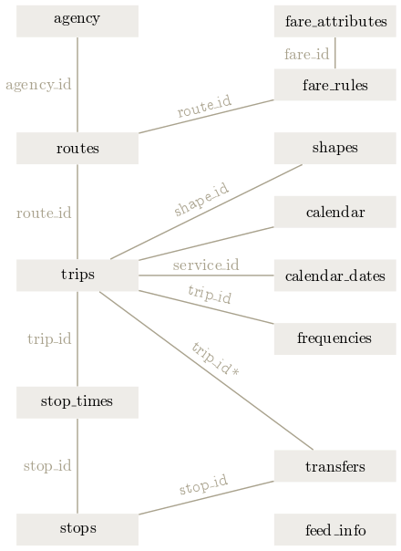
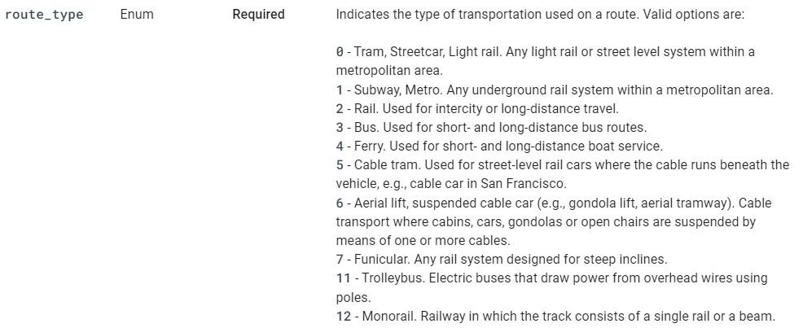

# Environment Setting
```{r message=FALSE, warning=FALSE}
# Import required packages
library(tidytransit)
library(tidyverse)
library(tmap)
library(ggplot2)
# library(gtfsrouter)
library(here)
library(units)
library(sf)
library(leaflet)
library(tidycensus)
library(plotly)
# library(igraph)
library(tidygraph)
# library(dodgr)
library(leafsync)
# source("https://raw.githubusercontent.com/BonwooKoo/gtfs_to_igraph/master/gtfs_to_igraph.R")

wd <- file.path(Sys.getenv('setwd'),"work/working/School/UA_2022/external/Lab/module_2")
setwd(eval(wd))
```

# What is the General Transit Feed Specification (GTFS)?

| The GTFS is a common format for public transit schedules and associated geographic information provided by transit agencies.

Before GTFS, there wasn't (to the best of my knowledge, at least) a standardized format for transit timetables other associated information. Users of transit data across multiple transit agencies had to deal with different data formats. With GTFS, feeds from different agencies became standardized (although not perfect), making applications of the data easy.

Useful Links:

* [tidytransit (i.e., R package) Vignettes](https://cran.r-project.org/web/packages/tidytransit/index.html)
* [Google GTFS](https://developers.google.com/transit/gtfs/reference)
* [Open Mobility Data - Archive of GTFS feeds from around the world](https://transitfeeds.com/)
* [transitland - Another archive of GTFS & other feeds](https://www.transit.land/)


Let's download some GTFS feed provided by Metropolitan Atlanta Rapid Transit Authority (MARTA). 

```{r, results='hide'}
# This GTFS file is downloaded from
# https://opendata.atlantaregional.com/datasets/marta-gtfs-latest-feed/about
atl <- read_gtfs('MARTA_GTFS_Latest_Feed.zip') 
```


<br>


# Understand GTFS
GTFS consists of multiple tables and comes in a zip file as a single package. Transit is a complex system that contains multiple components (e.g., routes, stops, service schedules) working together. The table below shows a brief description of what each data.frame contains. This table is taken from [Google](https://developers.google.com/transit/gtfs/reference).

**Table 1. Description of tables in GTFS feed**

Table name                Defines
----------------------    ---------------------    
agency                    (Required) Transit agencies with service represented in this dataset.                     
stops                     (Required) Stops where vehicles pick up or drop off riders. Also defines stations and station entrances.
routes                    (Required) Transit routes. A route is a group of trips that are displayed to riders as a single service.
trips                     (Required) Trips for each route. A trip is a sequence of two or more stops that occur during a specific time period.
stop_times                (Required) Times that a vehicle arrives at and departs from stops for each trip.
calendar                  Service dates specified using a weekly schedule with start and end dates. This file is required unless all dates of service are defined in calendar_dates.txt.
calendar_dates            Exceptions for the services defined in the calendar.txt. If calendar.txt is omitted, then calendar_dates.txt is required and must contain all dates of service.
fare_attributes           Fare information for a transit agency's routes.
fare_rules                Rules to apply fares for itineraries.
shapes                    Rules for mapping vehicle travel paths, sometimes referred to as route alignments.
frequencies               Headway (time between trips) for headway-based service or a compressed representation of fixed-schedule service.
transfer                  Rules for making connections at transfer points between routes.
pathways                  Pathways linking together locations within stations.
levels                    Levels within stations.
feed_into                 Dataset metadata, including publisher, version, and expiration information.
translations              Translated information of a transit agency.
attributions              Specifies the attributions that are applied to the dataset.
----------------------    ---------------------    

These tables are *relational table* that are connected through a system of join keys. The schematic below shows which tables are linked to which tables, through which join keys. Understanding this structure is essential in using GTFS.



Figure 1. GTFS relational table structure
IMAGE SOURCE: http://tidytransit.r-transit.org/articles/introduction.html


## What's inside `atl` object

Now, let's take a look the `atl` object in which we read the GTFA feed from MARTA. This object is a list. In it, `names(atl)` shows that there are `r length(atl)` data.frames. Notice that there are many tables displayed in Table 1 above, but only some of them are in `atl`. Notice in Table 1 that only some are required;  others are optional. 

```{r}
typeof(atl)
names(atl)
print(head(atl))
```

<br>


# Converting GTFS Into Geospatial Format

The function `gtfs_as_sf` converts 'shapes' and 'stops' tables in GTFS data into sf objects. In the print out below, you will notice that all other tables have not changed, but 'shapes' and 'stops' tables are now **Simple feature collection with XXX features and XXX fields** and have added column 'geometry' that contains a series of coordinates. 

Having these two tables in sf format is actually sufficient because we can join other tables to 'shapes' and 'stops' table using **join keys**.  


```{r}
atlsf <- tidytransit::gtfs_as_sf(atl, crs = 4326)
head(atlsf)
```


```{r}
a <- leaflet(atlsf$shapes) %>% 
  addProviderTiles(providers$CartoDB.DarkMatter) %>% 
  addPolylines(weight = 1, color = "red") %>% 
  addControl(htmltools::HTML("Route shapes"))

b <- leaflet(atlsf$stops) %>% 
  addProviderTiles(providers$CartoDB.DarkMatter) %>% 
  addCircles(weight = 3, color = "red") %>% 
  addControl(htmltools::HTML("Stop shapes"))

leafsync::sync(a,b)
```

These maps (route shapes on the left; stop locations on the right) show the coverage of MARTA. 


# Calculating Transit Service Quality

&nbsp;

## Calculate travel times from one station to all other stations
The tidytransit package offers a very convenient function that calculates the shortest travel times from a stop to all other stops. Try `?tidytransit::travel_times` to see what this function does and what arguments it takes. Notice that only two out of nine arguments are required, and the rest are optional. The required arguments are 'filtered_stop_times' and 'stop_name.' If you do not provide the optional arguments, the function will use the pre-populated values for the calculation.


**But if you run the function right away, there will be an error.** The error is caused by the fact that there are stations that share names but are far from each other. There may be more than one stations in different parts of the city that share their names. If this was the case, the duplicate names would not be errors in the data. However, if in reality there are no such stations, the duplicate names would be actual flaws in your data. 

The `travel_times()` function calculates travel time based on station names. This function is designed to throw an error if there are stops with the same name but are more than 300 meters apart. We need to eliminate duplicate names through the following steps:

1. For each unique station names in *stops table*, calculate how many duplicates there are and, if there are duplicates, calculate distances to the duplicate stops. `stop_group_distances()` function can do this.
2. Get names of the stops that have duplicates far from each other. If stops with duplicate names are close (e.g., within 200 meters), they may actually be same stations.
3. For all stops with duplicates > 200-meter distances, change their station names by appending (1), (2), ... (n) where n is the number of duplicates. For example, if there are two "MIDTOWN STATION"s, they will each be "MIDTOWN STATION (1)" and "MIDTOWN STATION (2)". 
4. One of the requirements for `travel_times()` function is that `atl` object contains a **transfer** table, which is absent when freshly imported from the hard drive. This is NOT always the case -- the transfer table is an optional table in GTFS definition. Some entities include transfer table by default, some don't. MARTA is among those who don't include transfer table. We can use `gtfs_transfer_table()` function from gtfsrouter package to *create* this table and include it to the `atl` object.
5. Finally, one of the two required arguments, 'filtered_stop_times', takes an output from a function called `tidytransit::filter_stop_times()`. This function takes two required arguments: (1) our `atl` object and (2) a date for which we'd like calculate travel time. You can also choose to specify (3) minimum departure time and (4) maximum arrival time.

Finally, you are ready to calculate travel times!

```{r message=FALSE}
# Step 1:
stop_dist <- stop_group_distances(atlsf$stops, by='stop_name') %>% 

# Step 2:  
  filter(dist_max > 200)

# Step 3
atl$stops <- atl$stops %>% 
  group_by(stop_name) %>% 
  mutate(stop_name = case_when(stop_name %in% stop_dist$stop_name ~ paste0(stop_name, " (", seq(1,n()), ")"),
                               TRUE ~ stop_name)) 

# Step 4
atl$transfers <- gtfsrouter::gtfs_transfer_table(atl, 
                                     d_limit = 200, 
                                     min_transfer_time = 120)
# Step 5
am_stop_time <- filter_stop_times(gtfs_obj = atl, 
                                  extract_date = "2021-08-14",
                                  min_departure_time = 3600*7, # input unit is in second. So 3500*7 is 7AM
                                  max_arrival_time = 3600*10)  # similarly, this is 10AM 

# travel_times
trvt <- travel_times(filtered_stop_times = am_stop_time,
                     stop_name = "MIDTOWN STATION",
                     return_coords = TRUE)
``` 

```{r}
trvt_pal <- colorQuantile(palette = "Reds", domain = trvt$travel_time)

leaflet() %>% 
  addProviderTiles(providers$CartoDB.DarkMatter) %>% 
  addCircles(data = trvt %>% st_as_sf(coords = c("to_stop_lon", "to_stop_lat"), crs = 4326),
             fillColor = ~trvt_pal(travel_time),
             stroke = F,
             radius = 300,
             fillOpacity = 0.7,
             popup = paste0("Travel Time from <br> <strong> MIDTOWN: ", round(trvt$travel_time/60, 2), " minutes <strong>") %>% 
               lapply(htmltools::HTML))
```


On average, you can see that it takes `r round(mean(trvt$travel_time)/60,1)` minutes from the Midtown Station to other stations. On the map, you can see that it takes longer time to get to stops that are further away from the Midtown Station. 
Let's do this calculation for other stops in different parts of the city to see if there are a particular corners of the city that are burdened with longer travel time on average. To do this, we will do the following steps:

1. Randomly sample a few stations from each Census Tract.
2. TBD

```{r}
# Average time to get to other stations
print(str_c("On average, it takes ", 
            round(mean(trvt$travel_time)/60,1), 
            " minutes to travel from the Midtown Station to all other stations."))
```


## Calculate area of service by SES
GTFS from MARTA contains information about both rails and buses. The 'routes' table in `atl` has a column named 'route_type,' which contains integer values denoting types of transit service. To see what each integer means, you will need to look at the link to the Reference provided above (or see below for a screen capture from the Reference). 



'routes' table contains route_types, which is needed for separating rail transit.
'shapes' table contains the shapefile needed for geo-operations such as buffer, intersections, etc.
Because 'routes' and 'shapes' table do not contain a common key, they need to be joined through 'trips' as intermediate table.

```{r}
# Filter out rail transit
route_trip <- atl$trips %>% dplyr::left_join(atl$routes, by = "route_id")

unique_shape <- route_trip %>% 
  dplyr::group_by(route_id) %>% 
  dplyr::slice(1) %>% 
  dplyr::ungroup()

route.shape <- atlsf$shape %>% inner_join(unique_shape, by = "shape_id")

# Route type is not really intuitive - let's fix that
route.shape <- route.shape %>% 
  dplyr::mutate(route_type = dplyr::case_when(
    route_type == "0" ~ 'Tram, Streetcar',
    route_type == "1" ~ 'Subway, Metro',
    route_type == "2" ~ 'Rail',
    route_type == "3" ~ 'Bus'
  ))
```

```{r}
pal <- leaflet::colorFactor(c("red", "orange", "pink"), domain = route.shape$route_type)

route.shape %>% 
  leaflet::leaflet(data = .) %>% 
    leaflet::addProviderTiles(providers$CartoDB.DarkMatter) %>% 
    leaflet::addPolylines(color = ~pal(route_type), 
                 weight = 3,
                 opacity = 0.9,
                 popup = paste0("Route type: ", route.shape$route_type))
  
```


Until Version 1.0, the sf package used 'equirectangular projection' for many operations that involve, for example, `intersects`, `intersection`, `union`, `nearest_point`, `st_join`, etc. It did so even when the given data is in geographical coordinates.

From Version 1.0, sf package uses S2 spherical geometry for spatial operations, based on S2 geometry library written by Google. For more information on what all of these means, you can read [this post](https://r-spatial.org/r/2020/06/17/s2.html#sf-10-goodbye-flat-earth-welcome-s2-spherical-geometry).

```{r}
# If we do not convert CRS to a projected one, the buffer may generate a ragged boundaries. 
# https://r-spatial.github.io/sf/articles/sf7.html#buffers-1
# https://r-spatial.org/r/2020/06/17/s2.html#sf-10-goodbye-flat-earth-welcome-s2-spherical-geometry
sf::sf_use_s2(TRUE)
MARTA_buffer <- route.shape %>% 
  sf::st_transform(crs = 26967) %>% 
  sf::st_buffer(dist = units::set_units(400, "m")) 

MARTA_buffer_group <- MARTA_buffer %>% 
  group_by(route_type) %>% 
  summarise()
```


```{r}
pal <- colorFactor(palette = c("red", "yellow", "blue"), domain = MARTA_buffer_group$route_type)

leaflet() %>% 
  addProviderTiles(providers$CartoDB.DarkMatter) %>% 
  addPolygons(data = MARTA_buffer_group %>% st_transform(crs = 4326), col = ~pal(route_type),
              popup = MARTA_buffer_group$route_type) 
```


# Overlaying GTFS with Census
```{r message=FALSE, warning=FALSE, echo=FALSE, results='hide'}
# Get American Community Survey
tidycensus::census_api_key(Sys.getenv('census_api'))
acs2020 <- tidycensus::get_acs(geography = "tract",
                   variables = c("hhinc" = 'B19013_001',
                                 "r_tot" = "B02001_001",
                                 "r_wh" = "B02001_002",
                                 "r_bl" = "B02001_003",
                                 "tot_hh" = "B25044_001",
                                 "own_novhc" = "B25044_003",
                                 "rent_novhc" = "B25044_010"),
                   year = 2020,
                   output = "wide",
                   state = "GA",
                   county = c("Fulton", "DeKalb", "Clayton"),
                   geometry = TRUE) 

acs2020
```

```{r, out.width="100%"}
acs2020c <- acs2020 %>% 
  select(GEOID,
         hhinc = hhincE,
         r_tot = r_totE,
         r_wh = r_whE,
         r_bl = r_blE,
         tot_hh = tot_hhE,
         own_novhc = own_novhcE,
         rent_novhc = rent_novhcE) %>% 
  mutate(pct_wh = r_wh / r_tot,
         pct_bl = r_bl / r_tot,
         pct_novhc = (own_novhc + rent_novhc)/tot_hh) %>% 
  mutate(area1 = unclass(st_area(.))) %>% 
  st_transform(26967) %>% 
  mutate(area2 = unclass(st_area(.))) %>% 
  st_transform(crs = 4326) %>% 
  mutate(ln_pop_den = log((r_tot / (area1/1000^2)) + 1)) %>% 
  filter(!is.na(hhinc), !is.na(r_tot), !is.na(own_novhc))

pal1 <- colorNumeric(palette = "YlOrRd", domain = acs2020c$hhinc)
pal2 <- colorFactor("Spectral", domain = MARTA_buffer_group$route_type)

leaflet() %>% 
  addProviderTiles(providers$CartoDB.DarkMatter) %>% 
  addPolygons(group = "ACS",
              data = acs2020c, 
              color = "grey", 
              fillColor = ~pal1(hhinc), 
              fillOpacity = 0.5,
              weight = 1, 
              popup = leafpop::popupTable(round(st_drop_geometry(acs2020c[,c("hhinc", "pct_wh", "pct_bl")]),2))) %>% 
  addPolygons(group = "MARTA",
              data = MARTA_buffer_group %>% 
                st_transform(crs = st_crs(acs2020c)), 
              color = ~pal2(route_type),
              weight = 1,
              opacity = 0.9) %>% 
  addLayersControl(
    overlayGroups = c("ACS", "MARTA"),
    options = layersControlOptions(collapsed = FALSE)
  )
```

```{r}
# Intersect buffer with tract 
buffer_per_tract1 <- acs2020c %>% 
  st_transform(crs = 26967) %>% 
  st_intersection(MARTA_buffer_group) %>% 
  filter(route_type == "Bus") %>% 
  # After Intersection
  mutate(subarea = unclass(st_area(.)),
         pct_served1 = subarea/area1,
         pct_served2 = subarea/area2) %>% 
  st_transform(crs = 4326)

buffer_per_tract2 <- acs2020c %>% 
  left_join(buffer_per_tract1 %>% select(GEOID, pct_served1) %>% st_set_geometry(NULL),
            by = "GEOID") %>% 
  # There are many NAs in the pct_served1 column
  mutate(pct_served1 = case_when(is.na(pct_served1) ~ 0,
                                 TRUE ~ pct_served1))

pal <- colorNumeric(palette = "YlOrRd", domain = buffer_per_tract2$pct_served1)

leaflet() %>% 
  addProviderTiles(providers$CartoDB.DarkMatter) %>% 
  addPolygons(data = buffer_per_tract2, 
              fillColor = ~pal(pct_served1), fillOpacity = 0.9, 
              color = "white", opacity = 0.2, 
              weight = 1) %>% 
  addLegend("bottomright",
            pal = pal,
            values = buffer_per_tract2$pct_served1,
            title = "% Area within 400m from transit line") 
```

Be careful when calculating area. `tm_shape( buffer_per_tract %>% mutate(diff = (area2 - area1)/area2)) + tm_polygons(col = 'diff', style = 'quantile')`

```{r}
# Is there any correlation between SES and service area?
var_name <- list(
  'hhinc'="Annual Household Income",
  'pct_bl'="% Black population",
  'pct_novhc'="% Household without vehicle",
  'pct_wh'="% White population",
  'r_tot'="Total population",
  'ln_pop_den' = "Population density"
)

var_labeller <- function(variable, value){
  return(var_name[value])
}

na_index <- buffer_per_tract2 %>% 
  select(hhinc, r_tot, ln_pop_den, starts_with('pct')) %>% 
  is.na(.) %>% 
  apply(., 1, function(x) sum(x)==0)

buffer_per_tract2 %>% 
  filter(na_index) %>% 
  pivot_longer(cols = c('hhinc', 'pct_wh', 'pct_bl', 'pct_novhc', "r_tot", "ln_pop_den"), names_to = "variable", values_to = "value") %>% 
  ggplot() +
  geom_point(aes(x = pct_served1, y = value), alpha = 0.4) +
  facet_wrap(~variable, scales = "free_y", labeller = var_labeller) +
  labs(x = "% Area with 400m beffer from transit line") +
  theme_bw()
```


```{r}
test_var <- c("hhinc", "pct_bl", "pct_wh", "pct_novhc", "r_tot", "ln_pop_den")

map_chr(test_var, function(x){
  cor.object <- cor.test(buffer_per_tract2[['pct_served1']], 
                         buffer_per_tract2[[x]])
  r <- round(cor.object$estimate,3)
  t <- round(cor.object$statistic,3)
  p <- round(cor.object$p.value,3)
  return(paste0("for ",x ,", r=", r, " (t=", t, ", p=", p, ")"))
})

```


# Reflecting the frequency differences

Since some stops have more frequent services than others, it is useful to consider the service frequency. 
Here, we are doing to focus on the morning commute time (7AM to 10 AM) and count the number of departures at each stops.

```{r}
service_ids <- atl$.$dates_services %>% pull(service_id)
stop_freq <- get_stop_frequency(atl, start_time = 3600*7, end_time = 10*3600, service_ids = service_ids, by_route = T) 
stop_freq_sf <- atlsf$stops %>% 
  left_join(stop_freq, by="stop_id") %>% 
  filter(!is.na(n_departures))

freq_pal <- colorNumeric("Reds", stop_freq_sf$n_departures)

leaflet() %>% 
  addProviderTiles(providers$CartoDB.DarkMatter) %>% 
  addCircles(data = stop_freq_sf,
             fillColor = freq_pal(stop_freq_sf$n_departures),
             fillOpacity = 0.8,
             weight = 10,
             stroke = FALSE,
             popup = str_c(stop_freq_sf$stop_name, ": ", stop_freq_sf$n_departures)) %>% 
  addLegend(position = "bottomright",
            pal = freq_pal,
            values = stop_freq_sf$n_departures,
            title = "Count of Departures <br> between 7AM and 10AM")
```

| Exercise: Do the calculating separately for rail transit and bus transit.


## Merge frequency by stop information with ACS data

```{r}
stop_tract <- acs2020c %>% 
  st_transform(crs = 4326) %>% 
  st_join(stop_freq_sf) %>% 
  group_by(GEOID) %>% 
  summarise(n_departures = sum(n_departures),
            hhinc = mean(hhinc),
            r_tot = mean(r_tot),
            pct_wh = mean(pct_wh),
            pct_bl = mean(pct_bl),
            pct_novhc = mean(pct_novhc),
            r_tot = mean(r_tot),
            ln_pop_den = mean(ln_pop_den))

knitr::kable(head(stop_tract))
```

```{r}
z <- function(vector){ round((vector - mean(vector))/sd(vector), 3) }

pass_per_stop_pal <- colorQuantile(palette = "Reds", domain = stop_tract$n_departures)

leaflet() %>% 
  addProviderTiles(providers$CartoDB.DarkMatter) %>% 
  addPolygons(data = stop_tract, 
              fillColor = pass_per_stop_pal(stop_tract$n_departures),
              fillOpacity = 0.8,
              color = 'grey',
              weight = 1, 
              popup = paste0("ID: ", stop_tract$GEOID, ", Value: ", stop_tract$n_departures)) %>% 
  addLegend(position = "bottomright",
            values = stop_tract$n_departures,
            pal = pass_per_stop_pal)

message(str_c("there are ", sum(is.na(stop_tract$n_departures)), " NAs in n_departures"))
```


```{r fig.align="center", echo = FALSE, out.width="100%", fig.height=10}
# Is there any correlation between SES and service area?
stop_tract_plot <- stop_tract %>% 
  mutate(hhinc = log(hhinc),
         pct_novhc = log(pct_novhc + 0.02)) %>% 
  pivot_longer(cols = c('hhinc', 'pct_wh', 'pct_bl', 'pct_novhc', "r_tot", "ln_pop_den"), 
               names_to = "variable", values_to = "value") %>%
  mutate(variable = factor(variable, labels = c('Household Income', "Population Density", "% Black", 
                                      "% No car", "% White", "Total Population")))

departure_count <- stop_tract_plot %>% 
  ggplot() +
  geom_point(aes(x = n_departures, y = value), alpha = 0.2) +
  facet_wrap(~variable, scales = "free_y") +
  labs(x = "Count of departures between 7AM and 10AM", title = "Departure Count VS. Socio-demographics") +
  theme_bw() 
```


```{r}
plotly::ggplotly(departure_count)
```


